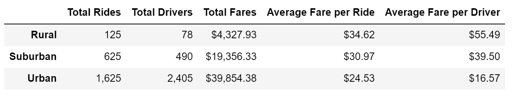

# PyBer Ride Sharing Analysis

## Overview

PyBer is a ride-sharing app company looking to improve access to its ride-sharing services and determine affordability for underserved neighborhoods.  Data from January to April 2019 was reviewed to understand the relationships among fares, drivers and rides across urban, suburban and rural cities.

## Resources

- Data Sources: [city_data.csv](Resources/city_data.csv), [ride_data.csv](Resources/ride_data.csv) 
- Software: Python 3.9.12, Jupyter Notebook 6.4.8
- the completed script is available **[here](PyBer_Challenge.ipynb)**

## Findings

This table summarizes data from a total of 120 cities from January to April 2019.

- There is a positive correlation between increasing population density and rides, drivers and total fares.
- There is a negative correlation between increasing population density and average fare per ride and average fare per driver.
- Urban areas have more drivers than riders 

This graph shows total fares collected over the analysis time period

## Summary
